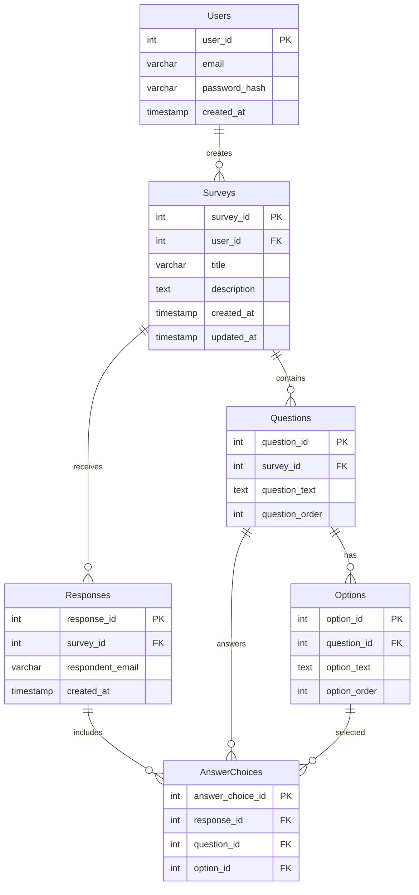

# Customer Feedback Database Schema

## Entity Relationship Diagram

## Schema Description

This diagram represents a customer feedback system with the following components:

- Users can create multiple surveys
- Each survey contains multiple questions
- Questions have multiple choice options
- Responses are collected for each survey
- Individual answer choices are tracked for each response
