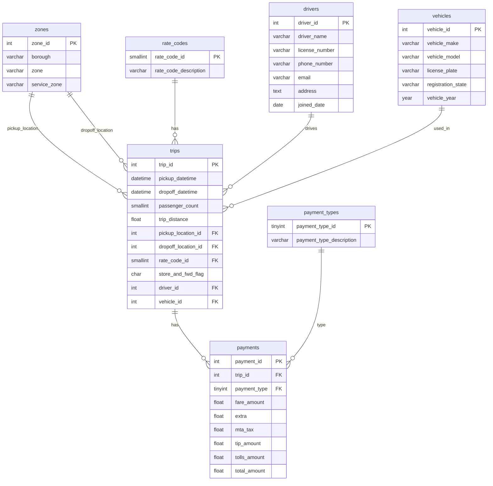

```mermaid
erDiagram
    zones {
        int zone_id PK
        varchar borough
        varchar zone
        varchar service_zone
    }
    rate_codes {
        smallint rate_code_id PK
        varchar rate_code_description
    }
    payment_types {
        tinyint payment_type_id PK
        varchar payment_type_description
    }
    drivers {
        int driver_id PK
        varchar driver_name
        varchar license_number
        varchar phone_number
        varchar email
        text address
        date joined_date
    }
    vehicles {
        int vehicle_id PK
        varchar vehicle_make
        varchar vehicle_model
        varchar license_plate
        varchar registration_state
        year vehicle_year
    }
    trips {
        int trip_id PK
        datetime pickup_datetime
        datetime dropoff_datetime
        smallint passenger_count
        float trip_distance
        int pickup_location_id FK
        int dropoff_location_id FK
        smallint rate_code_id FK
        char store_and_fwd_flag
        int driver_id FK
        int vehicle_id FK
    }
    payments {
        int payment_id PK
        int trip_id FK
        tinyint payment_type FK
        float fare_amount
        float extra
        float mta_tax
        float tip_amount
        float tolls_amount
        float total_amount
    }

    trips ||--o{ payments : has
    zones ||--o{ trips : pickup_location
    zones ||--o{ trips : dropoff_location
    rate_codes ||--o{ trips : has
    drivers ||--o{ trips : drives
    vehicles ||--o{ trips : used_in
    payment_types ||--o{ payments : type

```
